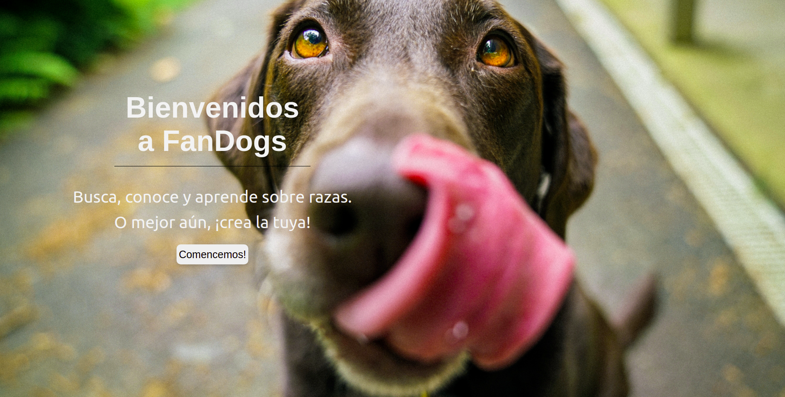
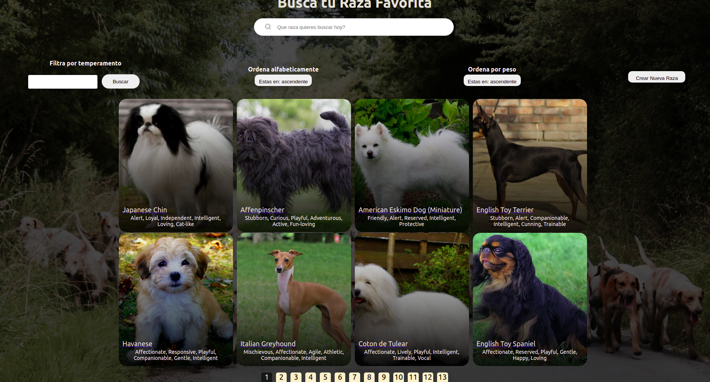
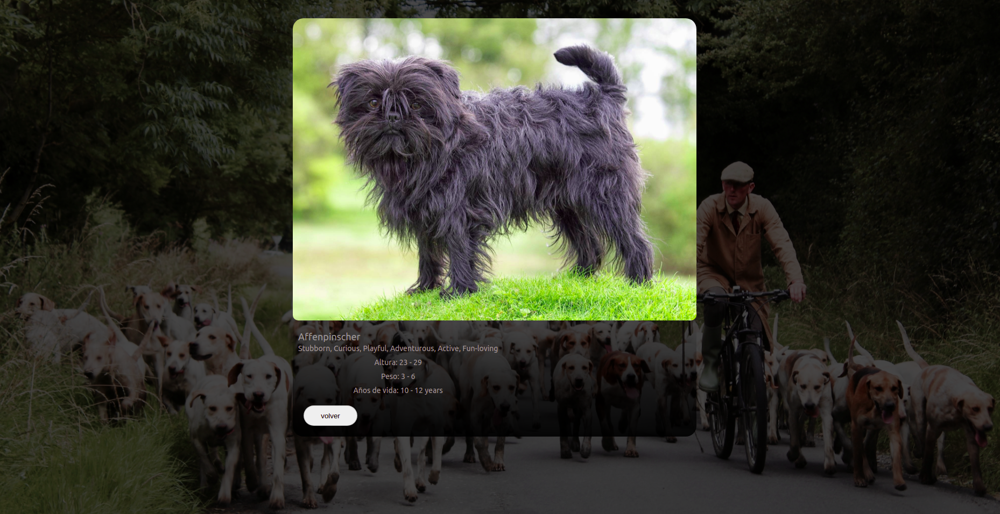
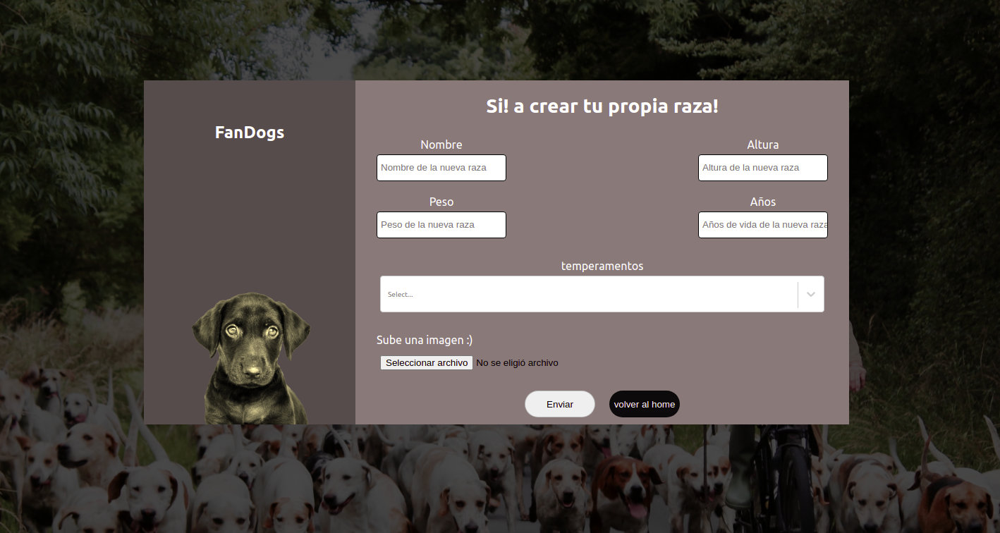

<p align='left'>
    
</p>

# Individual Project - Henry Dogs

<p align="left">
  
</p>

## Objetivos del Proyecto

- Construir una App utlizando React, Redux, Node y Sequelize.
- Afirmar y conectar los conceptos aprendidos en la carrera.
- Aprender mejores prácticas.
- Aprender y practicar el workflow de GIT.
- Usar y practicar testing.

---

### Empezando

#### Instalación

En client y api

```shell
npm install
```

Luego

```shell
npm start
```
---
### API

Para este proyecto utilizamos la [The Dog API](https://thedogapi.com/). La apikey se exporta del archivo .env.

---

### Ejemplo 






---

### Contacto

Luciano Nicolas Pereira - pereiralucianonicolas@gmail.com

<p aling='center'>
  <a href='https://www.linkedin.com/in/luciano-nicolas-pereira-dev'>
    
  </a>
</p>